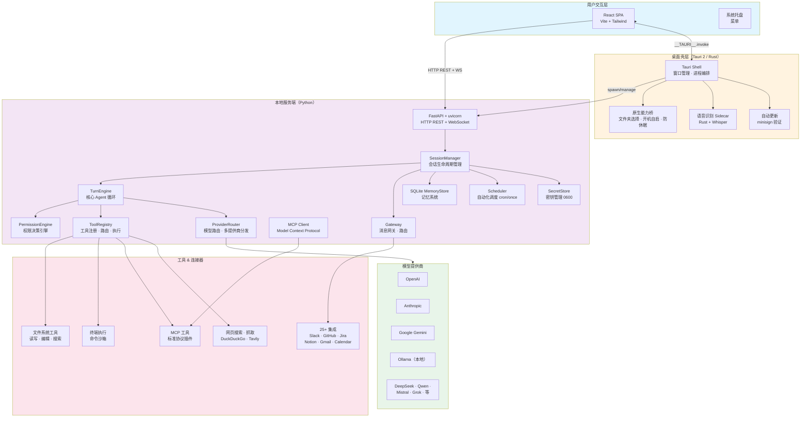
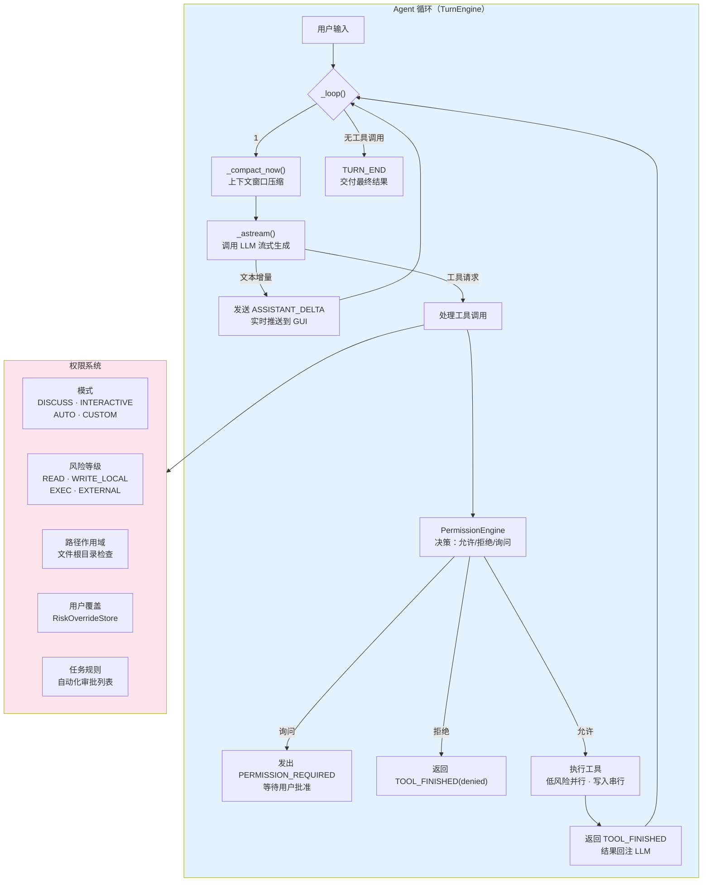
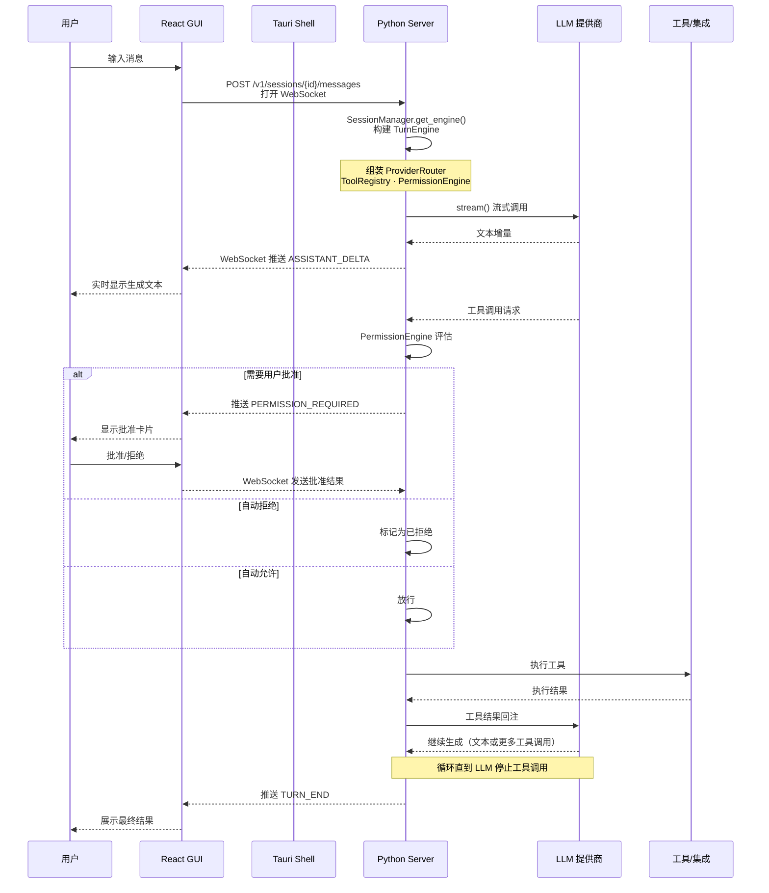
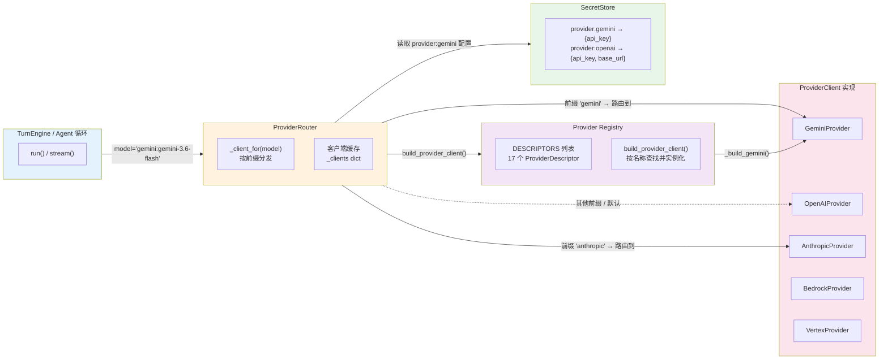

# OpenWorker

**[openworker.com](https://openworker.com)** · [下载](#下载) · [Issues](https://github.com/andrewyng/openworker/issues)

<a href="https://trendshift.io/repositories/91434?utm_source=trendshift-badge&amp;utm_medium=badge&amp;utm_campaign=badge-trendshift-91434" target="_blank" rel="noopener noreferrer"></a>

> **Beta** - OpenWorker 目前处于公开测试阶段：功能完整可用，自动更新，我们正在积极打磨细节。欢迎提交 [Issues](https://github.com/andrewyng/openworker/issues)。

**替你完成日常工作的 AI。** OpenWorker 是一款开源 AI 同事，运行在你的桌面上，交付的是**完成的工作成果**，而不仅仅是对话：一份排版精美的文档、带数据的 Slack 回复、更新后的日历、整理好的收件箱。

它在你的机器上运行，不受任何模型绑定：你可以使用自己的 API Key 接入 OpenAI、Anthropic、Google 或开源权重提供商，也可以通过 Ollama 完全本地运行。你的数据仅通过你*选择*的模型和集成服务离开你的机器。

[](https://openworker.com)

## 下载

[**⬇ macOS（Apple Silicon）**](https://download.openworker.com/mac)
<sub>macOS 12+ · 已签名并公证 · 自动更新</sub>

[**⬇ Windows 10/11（x64）**](https://download.openworker.com/windows)
<sub>安装包尚未代码签名，SmartScreen 会弹出警告；签名工作正在进行中</sub>

打开应用，添加模型密钥（或指向 Ollama），然后提出真实的需求。

## 工作原理

1. 告诉 OpenWorker 你想要的结果——"准备一份客户简报"、"梳理我的日历"、"起草一份报告"、"检查一下发布在 Jira 和 GitHub 上的进度"。
2. 它会将任务分解为步骤，并在你的桌面、文件和已连接的应用之间协同工作。
3. 在执行任何关键操作之前——发送消息、修改日历、运行命令——它会先征询你的批准或指示。
4. 你拿到的是已完成的可交付成果，而不是一张待办清单。

## 系统架构

### 整体架构

OpenWorker 采用 **sidecar 架构**：Rust/Tauri 桌面壳层管理一个 Python 子进程（HTTP/WebSocket 服务端），React SPA 在 Tauri webview 中加载并通过 localhost 与 Python 服务端通信。



### 内部组件架构



### 请求处理流程



## 功能

- **产出真正的交付物** - 文档、电子表格、报告和网页，以你可以打开和分享的文件形式呈现。
- **从 Slack 中协作** - 在频道中提及 `@OpenWorker`；桌面端会打开一个会话，使用你的工具完成工作，答案以回帖形式返回。
- **使用你日常使用的工具** - 25+ 集成，包括 GitHub、Slack、Jira、Notion、Linear、HubSpot、Outlook、monday.com、Gmail 和 Google Calendar，还有你的**终端和本地文件**。任何通过 [MCP](https://modelcontextprotocol.io/) 可用的工具也能接入，并支持按工具进行权限控制。
- **定时运行** - 自动化处理重复性工作：晨间简报、周报、持续监控某个频道。运行结果会在应用中展示完整记录。
- **执行前征询同意** - 写入、发送和 shell 命令都需要审批才能执行。无人值守运行时，待审批操作会归入收件箱，不会自动执行。

## 自带模型

模型访问权归你所有：选择一个提供商，粘贴你的密钥，随时切换。开箱即用支持：

**OpenAI · Anthropic · Google Gemini · Inkling（Thinking Machines） · GLM（Z.ai） · DeepSeek · Kimi（Moonshot） · Qwen · MiniMax · Mistral · Grok（xAI）** - 通过 **Together** 和 **Fireworks** 接入开源权重模型，通过 **Ollama** 完全本地运行。

精选模型列表标注了我们已验证过工具调用能力的模型。添加任意模型字符串可自行承担风险。

## 隐私

OpenWorker 以本地优先为原则。一切数据都保存在你的机器上：agent 循环、你的对话记录、连接器令牌和模型密钥——全部存放在应用的本地密钥存储中。唯一的云组件是一个为连接器提供 OAuth 握手代理的小型服务。你无需登录即可使用应用——通过手动创建的凭证/API 密钥来使用连接器。

## 从源码运行

前置条件：Python 3.10+、Node 20+，以及（桌面 shell 所需的）通过 [rustup](https://rustup.rs/) 安装的 Rust 工具链。

```shell
git clone https://github.com/andrewyng/openworker
cd openworker

# 1. 一次性初始化——在 .venv 创建 Python 虚拟环境
#    （Windows 上请使用 Git Bash 或 WSL 运行）
bash packaging/setup_dev_env.sh

# 2. 启动本地 agent 服务端
.venv/bin/openworker-server --cwd ~/some/project --port 8765
#    （Windows: .venv\Scripts\openworker-server.exe）

# 3. 在第二个终端中启动 UI
cd surfaces/gui
npm install
npm run dev        # 浏览器 UI 运行在 Vite 开发端口上
```

独立服务端会在 `<state-dir>/sidecar-8765.token` 创建一个每次启动唯一的令牌；Vite 启动时会读取此用户级文件。
直接调用 API 时，请将其值放入 `X-OpenWorker-Token` 请求头中传递。桌面应用使用内存中的启动令牌，不会写入磁盘。

要运行完整的桌面应用而非浏览器 UI，将步骤 3 替换为 `npm run tauri dev`（在 `surfaces/gui/` 目录下）——Tauri shell 会启动窗口并自行管理服务端。

测试：`.venv/bin/pytest`（服务端），在 `surfaces/gui` 目录下运行 `npm test` 和 `npm run e2e`（GUI 单元测试 + 封闭端到端测试）。桌面安装包通过 `packaging/build_dmg.sh` / `packaging/build_windows.ps1` 构建。

## 仓库结构

| 目录 | 内容 |
|---|---|
| `coworker/` | Python 后端——agent 引擎、模型提供商、连接器、MCP 客户端、记忆、自动化 |
| `surfaces/gui/` | 桌面应用——React UI + 管理服务端的 Tauri shell |
| `stt/` | 语音转文字 sidecar（Rust），用于语音输入 |
| `packaging/` | 安装包构建（macOS DMG、Windows）、自动更新清单、开发环境初始化 |
| `docs/` | 设计文档和决策记录 |
| `tests/` | 后端测试套件 |

## 项目统计

| 类别 | 数量 | 说明 |
|---|---|---|
| **Agents** | 4 | `chat`、`code`、`cowork`、`myhelper` |
| **Personas** | 4 内建 | `cowork`、`code`、`chat`、`ops` |
| **Skills** | 0（内置） | 运行时从用户目录动态加载，仓库仅含加载器代码 |
| **MCP** | 0（内置） | 全部由用户运行时配置；连接器描述中引用了 2 个 MCP URL（Jira、monday）、1 个 persona 推荐 |
| **Connectors** | 40 个描述符 | 35 个可用（含 Slack/GitHub/Gmail/Notion 等）+ 5 个占位 |
| **Tool 工厂** | 10 个 | 涵盖文件操作、终端执行、搜索、Git、待办、询问用户等 |
| **Model Providers** | 17 个 | OpenAI、Anthropic、Gemini、Bedrock、Vertex、Ollama、DeepSeek、Kimi、Qwen 等 |
| **Automation 工具** | 4 个 | 创建、列出、更新、删除定时任务 |

## 模型提供商加载机制

OpenWorker 通过统一的 `ProviderClient` 抽象层支持 17 个模型提供商，核心组件为 **注册中心（Registry）**、**路由（Router）** 和 **具体提供商实现**。

### 架构层级



### 注册中心（Registry）

`coworker/providers/registry.py` 定义了一个 `DESCRIPTORS` 列表，包含 17 个 `ProviderDescriptor`，每个描述符声明：

| 字段 | 说明 |
|---|---|
| `name` | 唯一标识，用作模型名前缀（如 `gemini:`） |
| `title` | UI 展示名称 |
| `fields` | UI 配置表单字段定义 |
| `build` | 工厂函数，接收 profile → 返回 `ProviderClient` 实例 |
| `recommended_model` | 推荐模型名 |
| `env_key` | 环境变量回退 |

### 路由（ProviderRouter）

`coworker/providers/router.py` 实现按模型名前缀分发：

1. `_provider_name(model)` — 解析模型字符串 `gemini:gemini-3.6-flash` → 提取前缀 `gemini`
2. `_client_for(name)` — 按前缀从缓存获取或通过 `build_provider_client()` 创建客户端
3. `_bare(model)` — 剥离前缀，传递裸模型名 `gemini-3.6-flash` 给 SDK
4. 缓存客户端到 `_clients` 字典，支持 `invalidate()` 热更新

> 注意 `:` 分隔符处理：只有前缀是已知提供商名时才路由，`qwen2.5-coder:32b` 这种模型内部 `:` 不会误触。

### 密钥管理（SecretStore）

`coworker/secrets.py` 管理 API 密钥，存储于 `~/.config/coworker/secrets.json`（0600 权限）：

- 支持 `${ENV_VAR}` 引用，读取时实时解析
- 配置文件以 profile 维度组织：`provider:gemini`、`provider:openai` 等
- `Router._client_for()` → `secrets.get("provider:gemini")` → 传给工厂函数

---

### 案例：Gemini 提供商加载全流程

以模型 `gemini:gemini-3.6-flash` 为例，从配置到运行的完整链路：

#### 1. 描述符注册

```python
# registry.py 第 288-303 行
ProviderDescriptor(
    name="gemini",
    title="Gemini (Google)",
    needs_key=True,
    fields=[
        ProviderField("api_key", "Gemini API key",
                      secret=True, placeholder="AIza…"),
    ],
    build=_build_gemini,
    recommended_model="gemini-3.6-flash",
    env_key="GEMINI_API_KEY",
)
```

UI 渲染为一个密钥输入框，placeholder 提示 `AIza…`（Gemini 密钥前缀）。

#### 2. 工厂函数

```python
# registry.py 第 138-141 行
def _build_gemini(profile: dict, secrets) -> ProviderClient:
    api_key = ((profile or {}).get("api_key") or "").strip() or None
    return GeminiProvider(api_key=api_key, secrets=secrets)
```

从 SecretStore profile 中提取 API key，连同 SecretStore 引用一起传给 `GeminiProvider`。

#### 3. 密钥解析

```python
# gemini_provider.py 第 104-115 行
def resolve_api_key(secrets=None):
    key = os.environ.get("GEMINI_API_KEY") or os.environ.get("GOOGLE_API_KEY")
    if key:
        return key
    if secrets is not None:
        profile = secrets.get("provider:gemini") or {}
        return profile.get("api_key") or None
    return None
```

优先级：`GEMINI_API_KEY` 环境变量 → `GOOGLE_API_KEY` 环境变量 → SecretStore 持久化配置。

#### 4. 延迟客户端初始化

```python
# gemini_provider.py 第 418-430 行
def _ensure_client(self):
    if self._client is None:
        from google import genai        # 延迟导入，不增加启动开销
        key = self._api_key or resolve_api_key(self._secrets)
        if not key:
            raise RuntimeError("No Gemini API key configured.")
        self._client = genai.Client(api_key=key)
    return self._client
```

仅首次调用时导入 SDK、解析密钥、创建客户端。引擎可在无密钥时先装配，密钥缺失推迟到第一次实际请求才报错。

#### 5. 消息转换（核心复杂度）

Gemini 的 API 格式与 OpenAI 标准格式存在多处差异，`convert_messages()` 负责转换：

| 差异 | 转换策略 |
|---|---|
| 系统提示词 | 从 `system` 角色消息提取 → 顶层 `system_instruction` 参数 |
| 角色映射 | `assistant` → `model`，`tool` → `user`（`function_response` 类型） |
| **工具调用无 ID** | Gemini 工具调用不含 ID → `complete()`/`stream()` 中合成 `call_<n>` |
| **结果匹配** | 按函数名称匹配（非 ID），在 `call_names` 映射中查找 |
| **思维签名（thought signature）** | 需要在下一次请求中回传否则循环断开 → 以 `_gemini` sidecar 持久化到消息历史 |
| **连续同角色合并** | Gemini 不允许连续 `user`/`model` → 合并相邻同角色消息 |
| **首条限制** | 第一条 content 必须为 `user` → 如果不是则插入空 user 消息 |

#### 6. 工具 Schema 转换

```python
# gemini_provider.py 第 275-319 行
def convert_tools(tools):
    # OpenAI 格式 → Gemini function_declarations
    # 通过 _sanitize_schema() 剔除 Gemini 不支持的 JSON Schema 关键字
    # 处理 list 类型的 type → 转为 anyOf 或 nullable
```

#### 7. Thinking/Reasoning 支持

```python
# gemini_provider.py 第 449-453 行
if model.startswith("gemini-"):
    config["thinking_config"] = {"include_thoughts": True}
```

所有 `gemini-*` 模型默认启用思考链输出，`thought` 类型的 part 被分离为 `reasoning_delta` 流式推送。

#### 8. `stream()` 完整调用链路

```python
# gemini_provider.py 第 492-547 行
def stream(self, *, model, messages, tools=None, **settings):
    kwargs = self._request_kwargs(...)          # 组装参数
    client = self._ensure_client()               # 获取/创建客户端
    for chunk in client.models.generate_content_stream(**kwargs):
        parsed = _parse_candidate(chunk)
        for thought in parsed.thoughts:
            yield StreamChunk(reasoning_delta=thought)  # 推理过程
        for text in parsed.texts:
            yield StreamChunk(text_delta=text)          # 文本增量
    yield StreamChunk(turn=AssistantTurn(...))           # 最终完整结果
```

### 各提供商关键差异

| 方面 | Gemini | OpenAI | Anthropic |
|---|---|---|---|
| **SDK** | `google-genai` | `openai` | `anthropic` |
| **工具调用 ID** | 无，合成 `call_<n>` | 原生 ID | 原生 ID |
| **结果路由** | 按函数名称 | 按 `tool_call_id` | 按 `tool_use_id` |
| **思维签名** | 必须回传（base64） | 无 | 无 |
| **Schema 格式** | OpenAPI 3.0 子集 | 完整 JSON Schema | Anthropic 自有格式 |
| **思考链** | `thinking_config` | N/A | `thinking` + budget |
| **历史折叠** | 必须合并连续同角色 | 不用 | 不用 |
| **密钥回退** | `GEMINI_API_KEY` → `GOOGLE_API_KEY` → Secrets | `OPENAI_API_KEY` → Secrets | `ANTHROPIC_API_KEY` → Secrets |

## 基于 aisuite 构建

OpenWorker 的引擎基于 [**aisuite**](https://github.com/andrewyng/aisuite) 构建，这是一个轻量级 Python 库，提供跨 LLM 提供商的统一 chat-completions API，以及包含工具、工具包和 MCP 支持的 agent 层。如果你想构建自己的 agent 框架而非使用我们的，可以从那里开始；本仓库是 aisuite 能力的一个实际参考示例。

OpenWorker 最初在 aisuite 仓库内部开发，之后迁移到独立的仓库；感谢 aisuite 的贡献者，我们的工作建立在他们的成果之上。

## 贡献

欢迎提交贡献和 bug 报告——请创建一个 [issue](https://github.com/andrewyng/openworker/issues) 或 pull request。应用会自动更新，因此修复能够快速到达用户手中。
对于任何 PR，请附上修复前后对比的截图。我们很快会添加可供贡献的功能。
请注意，我们根据内部清单和目标进行积极开发，因此可能不会批准添加已在开发中或偏离我们愿景的功能的 PR。

## 许可证

MIT - 参见 [LICENSE](LICENSE)。
