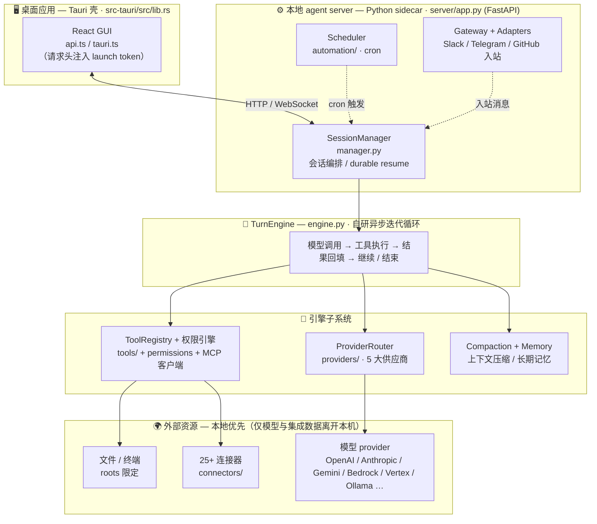
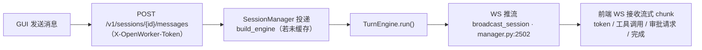
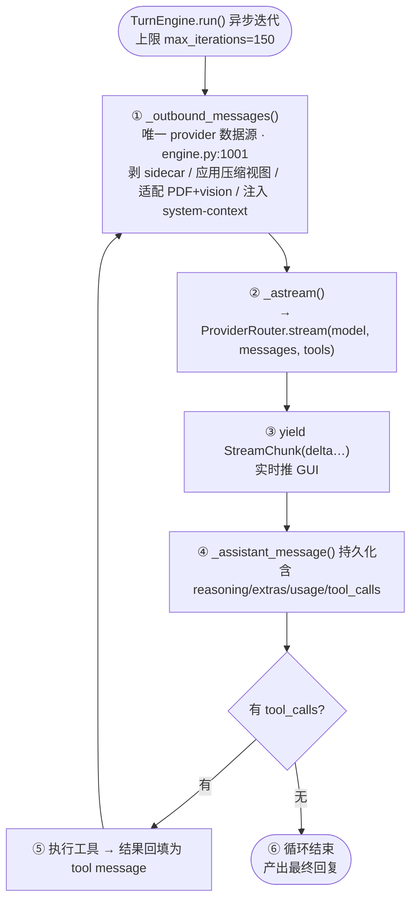
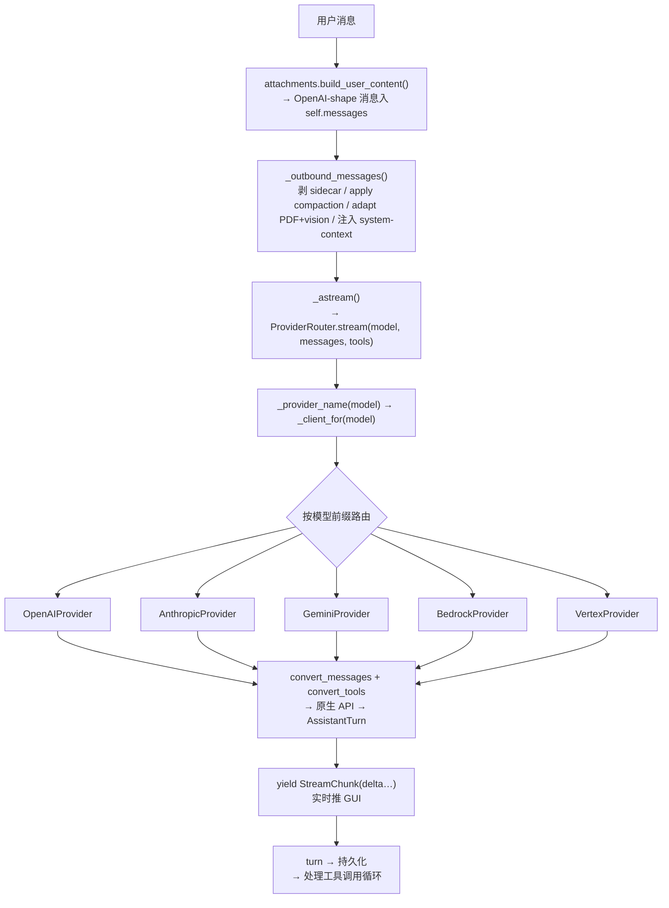
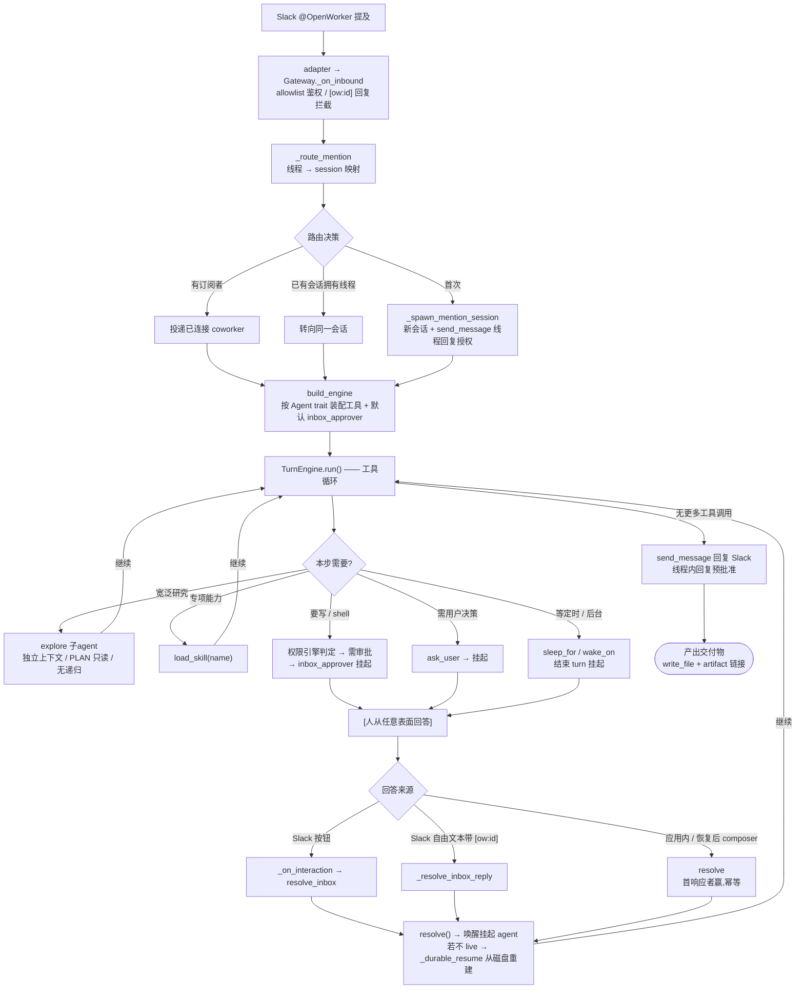

# OpenWorker 系统架构与技术分析

> 本文档基于对 `coworker/`(Python 后端)、`surfaces/gui/`(React + Tauri 前端)、`packaging/` 源码的逐文件研读,系统梳理 OpenWorker 的整体架构、功能模块、Agent 通讯方式、工作流程与 AI 供应商调用机制。所有引用均为 `文件路径:行号`,基于当前代码状态。

---

## 目录

1. [产品定位与设计哲学](#1-产品定位与设计哲学)
2. [系统总体架构](#2-系统总体架构)
3. [进程模型与前后端通讯](#3-进程模型与前后端通讯)
4. [核心引擎:TurnEngine 与 Agent 工作循环](#4-核心引擎turnengine-与-agent-工作循环)
5. [AI 供应商调用机制](#5-ai-供应商调用机制)
6. [工具系统、MCP 与权限审批](#6-工具系统mcp-与权限审批)
7. [Agent 通讯与编排](#7-agent-通讯与编排)
8. [连接器与外部集成](#8-连接器与外部集成)
9. [上下文管理:压缩、对话、记忆、附件](#9-上下文管理压缩对话记忆附件)
10. [自动化调度](#10-自动化调度)
11. [安全模型](#11-安全模型)
12. [持久化与 Durable Resume](#12-持久化与-durable-resume)
13. [本地优先架构](#13-本地优先架构)
14. [关键设计原则](#14-关键设计原则)

---

## 1. 产品定位与设计哲学

OpenWorker 是一个**开源、本地优先**的 AI 桌面 coworker。与聊天型 AI 不同,它的目标是交付**完成的成果**(一份文档、一条带数据的 Slack 回复、一个整理好的日历、一个分拣好的收件箱),而非一份待办清单。

三条贯穿全局的设计原则:

| 原则 | 含义 | 代码体现 |
|---|---|---|
| **交付成品** | agent 跨桌面/文件/应用工作,产出可分享的文件 | Cowork 家族 agent + write_file + artifact 交付链接 |
| **行动前请示** | 写操作、发送、shell 命令受审批门控;无人值守时挂起而非擅自行动 | 四模式权限引擎 + Inbox 挂起机制 |
| **本地优先** | agent 循环、对话、密钥、令牌都在本机;数据只在用户选定的模型与集成中离开 | sidecar 本地进程 + 0600 SecretStore |

它**不锁定模型**:OpenAI / Anthropic / Google Gemini / Bedrock / Vertex / 各开源厂商 / Ollama 本地,统一为同一套调用接口。

引擎**构建于 aisuite 之上**,但关系是**组合**而非继承——OpenWorker 只复用 aisuite 的工具实现与 schema 生成,核心 `TurnEngine` 是自研的异步迭代循环。

---

## 2. 系统总体架构



### 仓库布局

| 目录 | 内容 |
|---|---|
| `coworker/` | Python 后端:引擎、供应商、连接器、MCP、记忆、自动化 |
| `surfaces/gui/` | 桌面应用:React UI + Tauri 壳(监管 server 进程) |
| `stt/` | 语音输入 sidecar(Rust) |
| `packaging/` | 安装包构建(macOS DMG / Windows)、自动更新、开发引导 |
| `docs/` | 设计规范与决策日志 |
| `tests/` | 后端测试套件(`pytest`,asyncio_mode=auto) |

### 后端关键模块速览

| 模块 | 核心类/文件 | 职责 |
|---|---|---|
| 引擎 | `engine.py:TurnEngine` | agent 循环、provider 桥接、工具调度 |
| Agent 编排 | `agent.py:build_engine`、`agents/` | persona 装配、家族(chat/code/cowork) |
| 供应商 | `providers/router.py:ProviderRouter` | 模型字符串路由到 5 大 provider |
| 工具 | `tools/registry.py:ToolRegistry` | 工具注册 + schema 生成(复用 aisuite) |
| 权限 | `permissions.py:PermissionEngine` | 四模式 + 风险分级 + standing rules |
| MCP | `mcp/client.py`、`mcp/tools.py` | MCP server 连接与工具桥接 |
| 上下文 | `compaction.py`、`conversations.py` | 压缩、对话持久化 |
| 记忆 | `memory/` | 跨会话长期事实(SQLite) |
| 连接器 | `connectors/descriptors.py`、`tool_defs.py` | 25+ 集成 + OAuth + 入站/出站 |
| 服务端 | `server/app.py`、`server/manager.py` | FastAPI 端点 + 会话编排 + durable resume |
| 自动化 | `automation/scheduler.py` | cron 定时任务 |
| 安全 | `secrets.py`、`roots.py`、`workspace_trust.py` | 密钥/多根目录/信任门 |

---

## 3. 进程模型与前后端通讯

### 3.1 双启动模式

OpenWorker 后端是一个 FastAPI 服务(`server/app.py`),有两种启动方式,差异在 token 安全模型:

| 模式 | 启动方式 | launch token | 适用 |
|---|---|---|---|
| **桌面端** | Tauri 壳 spawn sidecar(`lib.rs`) | **内存**(`OPENWORKER_LAUNCH_TOKEN` 环境变量),从不落盘 | 正常使用 |
| **Standalone** | `.venv/bin/openworker-server` | **磁盘**:`<state-dir>/sidecar-PORT.token`(0600,仅用户可读) | 浏览器 UI 开发 / 直接 API 调用 |

`server/run.py:139 main()` 是统一入口(uvicorn)。Standalone 模式写 token 文件供 Vite 读取;桌面端用 `getppid` 检测父进程退出以触发孤儿清理(`server/run.py:18`)。

### 3.2 token 安全模型

- **桌面端**:Tauri 在 spawn sidecar 时注入一次性内存 token;前端 `tauri.ts` 经 IPC 拿到后注入每个请求的 `X-OpenWorker-Token` 头。token 永不落盘,进程结束即失效。
- **Standalone**:token 写入 `sidecar-8765.token`(用户专属文件,0600),Vite 启动时读取;直接 API 调用需手动传该值。
- 服务端校验(`app.py`):CORS / Origin 校验 + token 门,WS 连接还施加速率限制。

### 3.3 通讯协议

服务端暴露 **REST 端点 + 2 个 WebSocket 端点**:

- **REST**:会话 CRUD、消息发送、inbox resolve、设置/模型/连接器管理、记忆管理(`GET/POST /v1/memory`)、自动化、telemetry opt-out 等。
- **WebSocket `/ws/session/{id}`**(`app.py:1470 ws_session`):会话级双向通道,承载流式事件与交互回调。
- **WebSocket** 网关通道:入站消息(可选)。

### 3.4 一次对话的完整请求路径



前端通过 `api.ts`(HTTP)与 `tauri.ts` 的 `Session` 类(WS)与后端交互;token 在请求层统一注入。

### 3.5 Tauri 壳的进程监管(`lib.rs`)

桌面壳负责让"本地常驻 agent"可靠运行:

- **sidecar spawn 与监管**:探测端口、注入 token、启动 Python server,崩溃时重启。
- **孤儿进程三重清理**:Tauri 退出时杀 sidecar(`lib.rs:757`)+ sidecar 监听父进程退出(`run.py:18`)+ 单实例锁(`lib.rs:596`)。
- **常驻体验**:close-to-tray(`lib.rs:717`)、keep-awake 防休眠(`lib.rs:145`)、开机自启(`lib.rs:601`)。
- **自动更新**:检查 `download.openworker.com/latest.json`(GitHub Releases fallback),minisign 公钥验证后才安装(`lib.rs:485`)。

---

## 4. 核心引擎:TurnEngine 与 Agent 工作循环

`TurnEngine`(`engine.py`)是整个系统的核心——一个**自研异步迭代循环**,与 aisuite 是组合关系(仅复用其工具实现与 schema 生成)。

### 4.1 Agent 装配(`agent.py:109 build_engine`)

`build_engine()` 按 persona 装配引擎,决定一个 agent "是谁、能用什么":

- 从 `Agent`(`agents/base.py:28`)/`AgentContext` 取 system_prompt + tool_factory + 家族/消息/连接器 trait;
- 经 `catalog.py:162 expand()` 把 capability id 列表展开成具体工具可调用对象;
- 注入权限引擎、记忆(`memory_tools`,`agent.py:250`)、技能目录、self-wake 工具(仅 knowledge 家族);
- 设默认 approver = `inbox_approver`(无 socket 的运行一律走 Inbox)。

`get_agent()`(`agents/registry.py:15`)按 persona id 委托 personas registry 解析。

### 4.2 Agent 家族(`agents/`)

| 家族 | 用途 | 特点 |
|---|---|---|
| **chat** | 通用对话 | 基础工具 |
| **code** | 编码任务 | 用 explore 子 agent 做 fan-out 研究 |
| **cowork** | 交付成品 | scratch 目录 + 文件写入 + send_message/send_file |
| **myhelper** 等 | 其他 persona | 由 personas 配置 |

### 4.3 主循环(Turn Loop)

一次用户输入到产出回复,经历以下阶段:



**停止条件**:模型不再发起工具调用即结束;达到 `max_iterations` 上限;context overflow 触发压缩重试(`engine.py:352-357`)。

### 4.4 `_outbound_messages()` 的集中适配(关键设计)

所有 provider 一致性都在这一处保证(`engine.py:1001-1112`)。它使得**中途切换模型**成为仅写一个字段的安全操作(`switch_model`,`engine.py:189-216`)——存储的历史从不改变,只在出站时按当前模型能力重新决策。

### 4.5 工具执行

- 工具在循环中按需调度执行;交互式工具(`ask_user`/`propose_plan`/`request_directory`)走"引擎发事件 → 等待注入回调 → 回调返回值即工具结果"的统一模式(`engine.py:827-987`)。
- 回调是 mode-aware 的:有人值守 → 实时 inline 提示;无人值守 → Inbox item。
- `tool_call_id` 保证幂等(`engine.py:43`),支撑 durable resume。

### 4.6 四套 turn 驱动路径

前台 WS(`app.py:1727 run_turn`)、后台投递(`manager.py:2815 deliver_to_session`)、定时任务(`manager.py:3046`)、durable resume(`manager.py:853`)都 `async for event in engine.run/resume()`,都经 `broadcast_session` 流式推送——**前端无需区分来源**。

---

## 5. AI 供应商调用机制

### 5.1 统一抽象(`providers/base.py`)

`ProviderClient`(`base.py:101`)定义了 provider 无关接口:单次往返(无循环),返回 `AssistantTurn`(text / tool_calls / reasoning / extras / usage)。流式以 `StreamChunk`(delta / turn)表达。

**规范消息格式 = OpenAI chat completions**。所有 native provider 在调用边界做**纯函数转换**:

| Provider | 底层 | 认证 | 关键差异 |
|---|---|---|---|
| **OpenAI** (`openai_provider.py`) | `openai` SDK chat.completions | API key | 基准实现;兼容 Ollama / 各开源厂商 |
| **Anthropic** (`anthropic_provider.py`) | 原生 Messages API | API key | 支持 prompt caching;思考块经 `_anthropic` sidecar 持久化 |
| **Gemini** (`gemini_provider.py`) | `google-genai` | API key | 思考/签名经 `_gemini` sidecar |
| **Bedrock** (`bedrock_provider.py`) | Converse / AnthropicBedrock | boto3 凭证 | Converse 只接受 bytes(非 URL);Claude 走 AnthropicBedrock |
| **Vertex** (`vertex_provider.py`) | genai vertexai / AnthropicVertex / MaaS | ADC / 服务账号 | 一个 provider 三种后端(gemini / claude / openweight) |

### 5.2 模型字符串路由(`providers/router.py`)

`ProviderRouter`(`router.py:23`)按模型字符串前缀分发:

```
"anthropic:claude-..."  → AnthropicProvider
"openai:gpt-..."        → OpenAIProvider
"gemini:gemini-..."     → GeminiProvider
"bedrock:anthropic..."  → BedrockProvider (Claude)
"vertex:gemini-..."     → VertexProvider
"ollama:qwen3-coder"    → OpenAIProvider (OpenAI 兼容 /v1)
"together:..."          → OpenAI 兼容厂商直连
```

`_provider_name(model)` 路由、`_bare(model)` 剥前缀、`_client_for(model)` 懒构建并缓存 client。

### 5.3 流式输出(unified chunks)

引擎 `_astream()` 用 thread + queue 桥接 provider 的流式响应,各 provider 把 native 流转成统一的 `StreamChunk`。各 provider 的 `_usage_from` 统一扣除缓存份额:OpenAI/Gemini 的 `prompt_tokens` 包含缓存,各自扣除(`input = prompt - cached`);Anthropic 的 `cache_read/cache_creation` 单独字段。

### 5.4 工具调用(function calling)

工具 schema 由 `ToolRegistry`(`tools/registry.py:25`)复用 aisuite 的 schema 生成器产出(OpenAI 格式)。各 provider 把 OpenAI 格式工具转换为自有格式。对文本输出工具调用(部分 Ollama/qwen 模型)有**抢救解析**逻辑,最大化服务器兼容性;`_param_fix_retry` 处理 effort/max_tokens 等参数 400 错误并重试。

### 5.5 Prompt Caching

Anthropic caching:低于模型可缓存最小值的前缀静默不缓存;读取按约 0.1x 计费。OpenAI/Gemini 各自在 usage 扣除缓存份额,使计费口径跨 provider 一致。

### 5.6 多模态与 PDF

- 统一入口 `attachments.py:build_user_content()` 构建 OpenAI content-parts(image / pdf / text),限额 `MAX_ATTACHMENTS=8`。
- 各 provider 将 OpenAI parts 转为自有 block(Anthropic `image`/`document`;Gemini `inline_data`;Bedrock base64 解码为 bytes)。无法转换的附件降级为可见占位符,**绝不静默丢弃**。
- 无原生 PDF 能力的模型,引擎在出站时用 `pdf_support.py` 本地 fallback(pypdf 提取文本 / pypdfium2 渲染 PNG),按内容 sha256 缓存;**存储的历史从不改变**,中途切到 PDF-capable 模型会重发真实文档(`engine.py:1032-1056`)。无 vision 能力的模型,image part 替换为占位符。

### 5.7 错误处理与重试

- `errors.py:friendly_model_error()` 按错误正文匹配已知形状(无权限 / 无配额),翻译为用户友好提示;不匹配则返回原始错误。
- 引擎层:context overflow 400 → 路由到 compaction(`force=True`)压缩后 continue;其他 provider 失败 → 持久化 partial turn + ERROR 事件。
- `verify_provider_key()`(`registry.py:792`):Settings 的 Test 按钮做廉价只读调用验证凭证(各 provider 用免费端点),永不抛异常。

### 5.8 模型目录与能力探测

- `providers/matrix.py:MATRIX` 是**唯一主动推荐、标注、担保**的精简模型清单(<60 条,仅收录当代 agent-capable 模型),按 first-party / 直连厂商 / 转售商 / 云账户分组。
- `providers/capabilities.py` 提供保守启发式(支持 tools/vision/pdf/parallel_tool_calls),供自定义模型回退(自担降级风险)。
- Ollama 标记 `tools=True, vision=False, parallel_tool_calls=False`(保守);`_openai_compat` builder 的 key 只从厂商自己 profile 解析,**绝不从 OpenAI fallback**(防 key 误发到其他端点)。

### 5.9 端到端调用链路



---

## 6. 工具系统、MCP 与权限审批

### 6.1 工具注册中心(`tools/registry.py`)

`ToolRegistry`(`registry.py:25`)把普通 Python callable + aisuite `ToolMetadata` 包装成工具:复用 aisuite 的 `Tools` schema 生成器(`registry.py:14`),从 `__aisuite_tool_metadata__` 取元数据(`registry.py:39`)。`schema()`(`registry.py:70`)生成一个 OpenAI 格式工具 schema。

**职责正交**:registry 不管权限,permissions 不弹窗,risk 不含名字集合逻辑——各自单一职责。

### 6.2 内置工具(`tools/`)

| 工具 | 文件 | 风险 | 说明 |
|---|---|---|---|
| `read_file` | `files.py` | read | 行号化读取,workspace 边界检查 |
| `grep` | `search.py` | read | 替代 aisuite 慢速 search_files |
| `shell` | `shell.py` | exec | 执行命令,需审批 |
| `git_log/status/diff` | `git.py` | read | `-C root` 锁定仓库 |
| `todo` | `todo.py` | read | 任务清单 |
| `propose_plan` | `plan.py` | — | 计划提案(交互式) |
| `ask_user` | `ask.py` | — | 人在环问答(交互式) |
| `explore` | `subagent.py` | — | 派生子 agent |
| `request_directory` | `directories.py` | — | 目录请求(交互式) |

### 6.3 MCP 客户端(`mcp/`)

- `mcp/client.py:33` 连接 MCP server(stdio / streamable-http),`mcp.config.py` 管理 server 配置。
- `mcp/tools.py:26` 把 MCP 工具桥接成 agent 可用工具,命名规则 `mcp__<server>__<tool>`。
- **fail-closed**:`requires_approval` 默认 True;MCP-backed 连接器用 **PINNED allowlist**(`include_tools`),厂商新增工具永不自动进入(只能收缩不能扩张);连接失败移除种入的 server config。

### 6.4 风险分级与审批(`risk.py`、`permissions.py`)

`risk.py:18` 把工具分三类:**read**(只读,直接执行)/ **write**(写本地,需审批)/ **external**(对外发送,需审批)。判定顺序:静态表 → aisuite metadata(`requires_approval` → external)→ 默认 read。

`PermissionEngine`(`permissions.py:84`)的核心是四模式 + 决策:

| 模式 (`permissions.py:37 Mode`) | 行为 |
|---|---|
| **DISCUSS** | 最受限,只读 |
| **PLAN** | 只读,硬阻写/shell(子 agent explorer 用此模式) |
| **INTERACTIVE** | 写操作需逐次审批 |
| **AUTO** | 提高自主上限,但**写路径仍被 root 限定** |

`evaluate()`(`permissions.py:120`)综合 mode + 风险 + standing rules + grants 产出 `Decision`。

### 6.5 审批流与 Inbox 挂起

- 默认无 approver → `_deny_all`(`engine.py:49`,**安全默认**)。
- 需审批时 → `inbox.py:add_approval()` 创建 InboxItem → `inbox.wait()`(`inbox.py:323`)用 `asyncio.Event` **挂起 turn**(不阻塞进程)→ 人类从任意 surface 解答。
- `resolve()`(`inbox.py:295`)**首次响应者胜出**,幂等;resolve 后 `waiter.set()` 唤醒挂起的 agent。
- **grants 持久化**:用户授予的 "Always allow"(按工具/按命令)随 session 持久化,`get_engine` 重建时 `_apply_grants`(`manager.py:3328`)重新应用。

### 6.6 Standing Approvals(任务级长期授权)

自动化运行专用的"长期许可",三层:

1. **规则格式**(`automation/models.py:27`):`"tool target"`(如 `"email_send alice@x.com"`)。
2. **种入引擎**(`manager.py:_seed_task_rules`,2635):每次构建/恢复任务引擎时重新种入 `task_rules`。
3. **运行中铸造**(`manager.py:mint_task_rule`,2544):用户点 "Allow every time" → 服务端验证(必须是自动化运行 + 规则合格)→ 持久化 + 应用到 live engine。

**安全约束**(`permissions.py:standing_rule_candidate`,62):**仅 EXTERNAL 风险工具 + 声明了 target_arg + target 非空**才有资格;EXEC/写本地工具**永不**参与(否则 shell 会无限自动放行)。引擎匹配 `tool + 精确 target` 才放行。

### 6.7 多根目录(`roots.py`)

`RootDir`(`roots.py:18`):`path` + `writable` + `label`。**Index 0 永远是 primary scratch**(默认保存位置、相对路径解析基准)。同一个 `list[RootDir]` 对象**按引用**共享给 PermissionEngine(路径限定)、文件工具(解析)、context injector(告知 agent),运行时增删目录三层立即生效。

- `_under_root`(读:任意 root)/ `_under_writable_root`(写:必须可写 root)。
- 写工具在**所有模式**(含 AUTO)都强制路径限定;`../x.py` 在 AUTO 下仍被拒。
- `render_context()`(`roots.py:61`)生成注入 prompt 的 `<system-context>`,告知 agent 目录边界(软提示;硬约束在权限引擎)。

---

## 7. Agent 通讯与编排

### 7.1 子 Agent 机制(`tools/subagent.py`)

主 agent 通过 `explore` 工具派生子 agent 完成子任务:

- **独立上下文**:子 agent 是一个独立 `TurnEngine`,**中间读取过程不回流父上下文**,只返回最终报告 dict——这是隔离父上下文、控制 token 成本的关键。
- **能力受限**:`PermissionEngine(mode=PLAN)`(硬阻写/shell)、无 `explore` 工具(防递归)、10 轮上限。
- **可并行**:因无 approver + 低风险而可并行 fan-out(尤其 Code 家族做研究)。

### 7.2 Skill 机制(`skills/base.py`)

Skill 是**渐进式披露**的能力包:`load_skill(name)` 按需拉取 skill 正文,agent 用自己的工具执行。与工具/子 agent 的关系:skill 是"指令包",工具是"执行手段",子 agent 是"独立上下文的研究员"。

### 7.3 通讯的三个层次

OpenWorker 中 "agent 通讯" 指三类,都建立在统一的 **Inbox + target token** 抽象上:

| 层次 | 机制 | 说明 |
|---|---|---|
| **Agent ↔ Agent** | `explore` 子 agent | 父派生 → 子独立执行 → 返回报告 |
| **Agent ↔ 人** | Inbox(approval/question/directory/plan) | 挂起 turn,人类从任意 surface 解答 |
| **Agent ↔ 外部通道** | mentions + gateway + send_message | Slack/GitHub/Telegram 触发与回复 |

### 7.4 外部通道触发:mentions 路由

`mentions.py` 维护**线程 → session** 的去重映射。`MentionSessionStore` 是线程授权的**单一真相源**。target token `"platform:chat_id:thread_ts"`(`mentions.py:7`)同时承担查找、投递、授权三个职责。

入站流程(`gateway.py:122 _on_inbound`):① allowlist 鉴权 ② `[ow:id]` 回复拦截(消费掉,不当新轮)③ 交 `SessionManager._dispatch_inbound`(`manager.py:2860`)→ `_route_mention`(`manager.py:2933`):

- 有订阅者 → 投递给已连接 coworker;
- 已有会话拥有此线程 → 转向(steer)同一会话;
- 首次 → `_spawn_mention_session`(`manager.py:2976`)新会话 + 播种 `send_message` 线程内回复常驻授权 + 回复契约。

### 7.5 交互原语与按钮(`interactions.py`)

`ask_user`/审批/目录请求/计划都走 Inbox 模型。`Button`(`interactions.py:22`)= `(label, value)`,`encode/decode` 把 `(item_id, resolution)` 编进按钮 value。`buttons_for()`(`interactions.py:43`)按 item kind 生成按钮——provider 无关,每个 adapter 原生渲染(Slack Block Kit / Telegram inline keyboard)。

按钮点击 → `Gateway._on_interaction`(`gateway.py:76`)鉴权 → `SessionManager._on_interaction`(`manager.py:2700`):decode → **Slack 审批所有权校验**(`protected_kinds` 必须是指定 owner)→ `resolve_inbox` → 释放挂起 agent(首响应者赢)→ 按钮换成纯文本结果。

### 7.6 无人值守(Unattended)与自唤醒(Self-wake)

**Unattended**(`unattended.py:17`):per-session bool 标志,持久化。它**不改自治上限**(那是 mode 的事),而是改变"人在哪里被触达"——本该 inline 提示的改路由到 Inbox,agent 挂起等回答,composer 禁用。

**Self-wake**(`selfwake.py:47 WakeStore`):把常驻 agent 变成 suspend/resume(事件驱动,接近零空闲成本)。三种触发:

- **timer**:`sleep_for(seconds)` / `sleep_until(iso)`
- **completion**:`wake_on(job_id)`(后台任务完成)
- **event**:`wake_on_event(event_key)`(命名连接器/webhook)

状态机 `pending → due → fired`。`SessionManager.resume_due_wakes()`(`manager.py:2776`)被调度器 tick 调用,对每个 due wake 投递唤醒消息(如 `"⏰ Wake — the timer you set has fired."`),然后 `mark_fired`。**selfwake 只给 knowledge family**(`agent.py:240`)。

### 7.7 端到端 Agent 工作流



---

## 8. 连接器与外部集成

### 8.1 数据驱动的连接器(`connectors/`)

连接器是**数据驱动**的:`ConnectorDescriptor`(`descriptors.py`,注册中心)+ `TOOL_DEFS`(`tool_defs.py`,工具目录 + 审批策略)让新增连接器主要是"数据 + 工具闭包",GUI/审批/账户层自动复用。

内置连接器(25+)按分类:消息(Slack/Telegram/Discord)、办公(Gmail/Outlook/Google Calendar/HubSpot/monday.com)、开发(GitHub/Jira/Linear/Notion)、浏览器自动化(playwright)、以及任意 MCP server。

### 8.2 连接器 → 工具

`integration_tools.py`(工具工厂)把每个连接器的 API 能力暴露成 agent 可调用工具。**审批的单真相源**:`tool_defs.kind`(read/write)是唯一决定审批的字段,`approval_for_tool` 覆盖所有调用点标志,防止"忘标 read 导致误审批"。

工具调用时从 `SecretStore` 读凭证;`_resolve_within` 防路径穿越;GitHub token 仅内存铸造(installation token,短命)。

### 8.3 发送类工具(`connectors/tools.py`)

- **`send_message`**(`tools.py:169`):解析发送目标(send target resolution),Slack 线程回复预批准。
- **`send_file`**(`tools.py:340`):发送文件附件。
- 出站走**无状态 Sender**(`senders.py`,一次性 HTTP);`send_message` 工具不经 gateway(gateway 是薄 inbound 路由)。

### 8.4 账户管理与多租户

Slack team / GitHub installation / HubSpot portal / Gmail mailbox / 通用 account 都走**"profile 指针 + per-tenant 子 profile"**模式:

- `accounts.py` / `gmail_accounts.py` / `gcal_accounts.py` / `hubspot_portals.py` / `github_installs.py` 管理多账户。
- `is_authorized()`(`config.py:43`):若 `source.team_id` 非空,用 per-workspace allow-list;**未知 team 直接拒绝(park)**。

### 8.5 OAuth 与云端代理(`cloud.py`)

每个 OAuth 连接器都有**手动字段**(手动 token/API key 始终可用,`cloud.py` 头注释视本地开源流程为 "sacred")。云端服务(`cloud.py`)只代理 OAuth 握手——因为 OAuth 回调需要公网可达的 redirect URL,本地机器无法直接接收。

### 8.6 Slack 入站:两条互斥路径

| 路径 | 文件 | 特点 |
|---|---|---|
| **手动 Socket Mode** | `adapters.py:SlackAdapter` | 用户自填 bot_token + app_token;`slack_bolt` AsyncSocketModeHandler;20s 看门狗重连 |
| **托管云端 Relay** | `relay_client.py:SlackRelayAdapter` | "Add to Slack" OAuth,**无需手填 token**,**支持多工作区**;事件经单条认证 WebSocket 推送;回复仍走桌面→Slack Web API 直连 |

`RelayHub`(`relay_client.py:62`)是多 provider 共享的桌面↔cloud 单 socket(Slack + GitHub)。四种帧:event(事件)/ interactivity(按钮)/ missed(离线补偿拉取)/ revoked(工作区移除)。Token 健康探测把 Web API 结果映射到 token 状态。

多工作区寻址:`slack_addr.py:qualify(team_id, channel)` = `"T…/C…"`(用 `/` 拼接,因 target 语法是冒号定界);relay 模式 reply handle 是 team-qualified,Socket Mode 是 bare。

### 8.7 实验性连接器与打包剥离

`connectors/experimental/` 的边界:① 隐藏在 `experimental-connectors` 设置开关后(默认关);② 连接时需**显式逐连接器风险确认**(`risk_notice`);③ 从官方桌面构建整体剥离。

打包(`packaging/openworker-server.spec:38-50`)同时**从 hiddenimports 过滤 + 加入 excludes 黑名单**,代码彻底剥离。自构建者用 `COWORKER_EXPERIMENTAL=1 ./build_dmg.sh` opt-in。

---

## 9. 上下文管理:压缩、对话、记忆、附件

### 9.1 上下文压缩(`compaction.py`)

当 context 超限,`build_state()`(`compaction.py:399`)执行一次压缩:总结 + 机械提取关键状态。`apply_to_outbound()`(`compaction.py:491`)**只生成出站视图**,存储的历史从不改变——这让压缩可逆、保缓存稳定、安全支持中途切换模型。

`CompactionState`(`compaction.py:82`)记录 boundary_index + summary + working_state + user_messages。无 LLM 兜底 `trim_state()`(`compaction.py:432`)推进边界 10%。

引擎层:context overflow 400 → 路由到 compaction(`force=True`)压缩后 continue;进度守护保证每轮推进边界或放弃,最终进入错误路径终止。

### 9.2 对话持久化(`conversations.py`)

`ConversationStore`(`conversations.py:62`)= **SQLite 索引 + JSONL 消息日志**。`SessionRecord`(`sessions.py:13`)持有会话元数据 + messages 列表。

### 9.3 记忆系统(`memory/`)

跨会话的持久事实/偏好,与对话(单次会话消息序列)本质不同:

| 维度 | memory | conversations |
|---|---|---|
| 本质 | 跨会话持久事实/偏好 | 单次会话消息序列 |
| 存储 | `coworker.db` SQLite 的 `memories` 表 | ConversationStore(SessionRecord) |
| 注入 | 拼进 system prompt 的 "Known memories" 块 | 作为 messages 喂给 provider |
| 生命周期 | 主动 remember/forget | 会话删除即消失 |
| 作用域 | global / workspace / session 三级 | 仅 session |
| agent 自改 | `memory_update`/`memory_forget` 工具 | 不直接改历史 |

注入点(`agent.py:250 build_engine`):查询 `list(scope=GLOBAL)` + `list(scope=WORKSPACE)`,经 `format_memories` 渲染成 `[#id] 用户偏好...` 追加到 instructions。`[#id]` 让 agent 能引用并修正/退役。GUI 经 `GET/POST /v1/memory` 直接管理。

### 9.4 附件与 PDF

见 [§5.6](#56-多模态与-pdf)。统一 OpenAI content-parts 格式,各 provider 转换;无原生能力时本地 fallback,**绝不静默丢弃**。

---

## 10. 自动化调度

### 10.1 调度器(`automation/scheduler.py`)

基于 `croniter` 的 cron 调度。`Scheduler` 的 `extra_tick`(`manager.py:183`)指向 `resume_due_wakes`,同一个调度循环既触发定时任务又唤醒挂起的 self-wake。

### 10.2 定时任务执行

`SessionManager._run_scheduled_task`(`manager.py:3046`):cron 触发 → 构建任务引擎 → 投递到会话 → 后台 turn 驱动(无 live socket 路径)→ 事件广播到该会话所有 socket。运行结果(完整 transcript)落在 app。

### 10.3 自动化运行的安全

- **standing approvals**:见 [§6.6](#66-standing-approvals任务级长期授权)。EXTERNAL 工具 + 精确 target 可自动放行;写本地工具被路径限定到任务 workspace。
- **未值守自动放行**:`_scheduled_approver`(`manager.py:2603`)在 unattended 任务运行时,对 `WRITE_TOOLS` 和任务按名允许的工具直接 `ONCE` 放行(路径已被限定);其余仍 park Inbox。
- **时区**:Windows 无系统 tz db,故 `pyproject.toml` 强制 `tzdata; sys_platform == 'win32'`,否则命名时区会静默回退到本地时间。

---

## 11. 安全模型

OpenWorker 的安全设计是**fail-closed 贯穿** + **硬约束(路径)与软门控(风险)分离**。

### 11.1 安全默认

- 无 approver → `_deny_all`(`engine.py:49`)。
- MCP server `requires_approval` 默认 True;PINNED allowlist,厂商新工具永不自动进入。
- OAuth 无 token → 跳过不开浏览器。
- `mint_task_rule` 服务端验证,不信任前端卡片。
- 连接失败移除种入的 server config。

### 11.2 路径是硬约束,风险分级是软门控

即使 AUTO 模式,写操作仍被 root 限定(`../` 逃逸被拒);而 standing rule 的精确 target 绑定让 EXTERNAL 工具能安全自动放行。

### 11.3 密钥存储(`secrets.py`)

设计铁律(`secrets.py:3`):**"secrets never enter the model's context, prompts, or traces"**。

- `SecretStore`(`secrets.py:106`):v1 是 **0600 JSON 文件**(`state_dir()/secrets.json`)。profile 键形如 `connector[:account]`。
- **`${ENV_VAR}` 引用解析**(`secrets.py:122`):profile 可存环境变量引用而非明文。
- **OS 级保护**(`_restrict_to_user`,`secrets.py:59`):POSIX `chmod 0600/0700`;Windows `icacls` 带继承标记(否则子文件 DACL 空 → SQLite 打不开崩溃)。
- `status()`(`secrets.py:142`)只返回元数据,**绝不返回值本身**。
- `state_dir()`:`$COWORKER_STATE_DIR` → `%APPDATA%\coworker` → `~/.config/coworker`。

### 11.4 配置分层(`config.py`)

`Config`(`config.py:27`)分层加载:内置默认 `< 全局 `state-dir`/config.toml` `< workspace `.coworker/config.toml`。

**关键安全约束**:`_GLOBAL_ONLY_FIELDS = {"allowed_commands", "auto_allow"}`(`config.py:80`)——改变"什么操作能免提示执行"的字段**workspace 覆盖无效**,只能用户全局设置。`DEFAULT_ALLOWED_COMMANDS = []`(无任何命令绝对安全)。

### 11.5 信任门(`workspace_trust.py`)

`WorkspaceTrustStore`(`workspace_trust.py:19`):信任跟随**路径**而非配置快照(`canonical = resolve()`)——未来该路径下的配置变更都被接受,直到用户撤销信任。repo 在 `.coworker/config.toml` 声明 `allowed_commands` → GUI 提示信任 → `set_workspace_trust` 立即应用到 live 会话引擎。

---

## 12. 持久化与 Durable Resume

核心思想:四类交互提示(审批/提问/目录/计划)都 park 成 Inbox item 并经 `inbox.wait` 挂起,**断 socket 不丢,可从任意交互面恢复**。

### 12.1 检查点持久化

`_CHECKPOINTS = {"turn_start","permission_required","directory_requested","plan_proposed","iteration_end"}`(`app.py:1719`)。事件落到这些类型时立即 `manager.save(session_id, engine)`——崩溃/退出吃不掉对话。park 新提示时也落盘,确保 pending tool call 在磁盘上。

### 12.2 resume 流程(`manager.py:840 resolve_inbox`)

1. `inbox.resolve(item_id, resolution)`(首响应者赢,幂等)。
2. 若 asking agent **仍 live 挂起** → 那个 `await` 直接返回。
3. 否则(`not is_running`,进程重启或引擎被逐出)→ `_durable_resume(item)`(`manager.py:853`):需有 `tool_call_id`(保证幂等);`get_engine` 从已存 `SessionRecord.messages` 重建引擎;迭代 `engine.resume()` 从中断的工具调用处续上;save。

### 12.3 重建引擎时恢复的上下文(`get_engine`,`manager.py:362`)

record 的 model/mode/messages、extra_roots、`grants`(`_apply_grants` 重新 apply "Always allow")、compaction_state;自动化 run session 重新 `_seed_task_permissions`;mention 派生会话重新种 `send_message` 授权。

`is_running` / `try_mark_running` / `mark_idle`(`manager.py:2792`)用 `_running_sessions` 集合保证一个会话同一时刻只有一个 turn 在跑。

### 12.4 级联清理(`delete_session`,`manager.py:3628`)

一次性清:引擎 + 会话记录 + 订阅 + 提及线程映射 + 连接器 override + pending Inbox 项(`resolve_session`)+ scratch 目录(**严格限定在 scratch_base 内,绝不碰用户真实项目文件夹**)。

---

## 13. 本地优先架构

### 13.1 留在本机、不离开的数据

- agent 循环、对话历史(ConversationStore)、记忆(SQLite)。
- 连接器令牌/模型密钥(SecretStore,0600 / `${ENV}` 引用)。
- 审计/Inbox/订阅/wakes/automation(JSON / SQLite)。
- Slack 通讯录/频道列表(本地缓存,"never leaves this machine")。
- 语音听写(浏览器构建不上传麦克风音频)。

### 13.2 离开本机的数据(有限)

- **对 LLM provider 的调用**:用户配置的 provider(Ollama 可完全本地)。
- **OpenWorker Cloud(可选)**:托管 OAuth 握手代理;未登录也可用(手动 token 粘贴始终可用)。
- **telemetry**:仅"content-free facts"(session_id/persona_id/family/workspace_kind);**未登录或 opted out 时是硬 no-op**。
- **连接器出站动作**:agent 经授权工具向 Slack/GitHub/Gmail 发消息——这是用户要的工作产出,非遥测。
- **自动更新**:检查 `download.openworker.com/latest.json`,minisign 公钥验证后才装。

### 13.3 进程级常驻保障

close-to-tray、keep-awake、开机自启、孤儿进程三重清理、单实例——共同保证"本地常驻 agent"在用户不看时仍可靠运行(自动化、消息订阅、self-wake)。

---

## 14. 关键设计原则

1. **单一真相源**:`InboxStore` 是人类注意力的唯一权威记录,`MentionSessionStore` 是线程授权的唯一真相源——所有表面(app / Slack / Telegram / 恢复后 composer)操作同一份幂等记录。

2. **target token 单串通**:`"platform:chat_id:thread_ts"` 一个字符串同时承担查找、投递、授权三个职责。

3. **挂起而非轮询**:Unattended + Self-wake + Inbox.wait 把 agent 变成事件驱动,接近零空闲成本。

4. **子 agent 隔离上下文**:explore 的价值在于"中间过程不污染父上下文",且因无 approver + 低风险而可并行。

5. **职责正交**:registry 不管权限,permissions 不弹窗,risk 不含名字集合逻辑。

6. **路径是硬约束,风险是软门控**:即使 AUTO 模式,写操作仍被 root 限定;精确 target 绑定让 EXTERNAL 工具安全自动放行。

7. **fail-closed 贯穿**:安全默认(deny_all / MCP allowlist / 无 token 跳过 OAuth),从不信任前端,连接失败移除配置。

8. **集中适配**:`_outbound_messages()` 是唯一 provider 出口,使中途切换模型成为安全操作;compaction 只改出站视图,存储历史不变。

9. **durable resume**:检查点 + Inbox park + `tool_call_id` 幂等,让挂起的会话跨进程重启可恢复。

10. **数据驱动扩展**:Descriptor + TOOL_DEFS 让新增连接器主要是数据 + 闭包,GUI/审批/账户层自动复用;新增 provider 只需实现 `convert_messages`/`convert_tools` 纯函数转换。

---

## 附录:关键文件索引

| 子系统 | 关键文件 |
|---|---|
| 引擎 | `coworker/engine.py`、`coworker/agent.py` |
| Agent 编排 | `coworker/agents/{base,chat,code,cowork,registry}.py` |
| 供应商 | `coworker/providers/{base,router,registry,capabilities,matrix,errors}.py` + 五大 provider |
| 工具 | `coworker/tools/{registry,files,shell,git,search,todo,plan,ask,subagent,directories}.py` |
| 权限/风险 | `coworker/permissions.py`、`coworker/risk.py` |
| MCP | `coworker/mcp/{client,tools,config}.py` |
| 上下文/记忆 | `coworker/{compaction,conversations,sessions}.py`、`coworker/memory/` |
| 连接器 | `coworker/connectors/{descriptors,tool_defs,integration_tools,tools,base,gateway,adapters,relay_client,senders,github_relay,cloud}.py` |
| 服务端 | `coworker/server/{app,manager,run}.py` |
| 自动化 | `coworker/automation/{scheduler,store,models,tools}.py` |
| 通讯 | `coworker/{mentions,inbox,inbox_routing,interactions,unattended,selfwake,subscriptions}.py` |
| 安全 | `coworker/{secrets,config,roots,workspace_trust}.py` |
| 前端/壳 | `surfaces/gui/src/{api,tauri}.ts`、`surfaces/gui/src-tauri/src/lib.rs` |
| 打包 | `packaging/{build_dmg.sh,build_windows.ps1,openworker-server.spec}` |

---

*本文档由对源码的逐文件研读整理而成,反映分析时的代码状态。*
