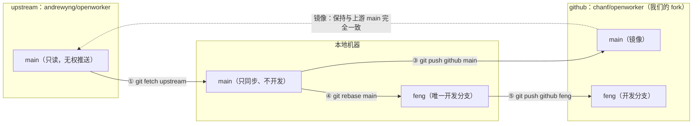
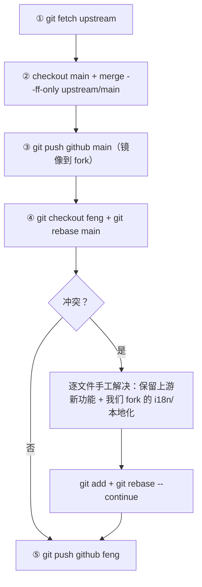
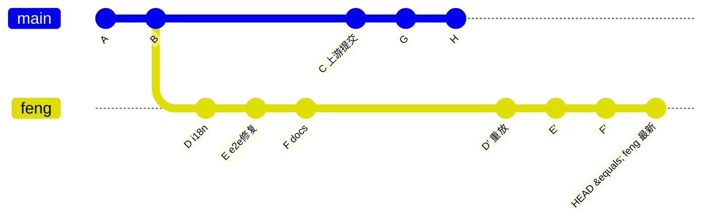
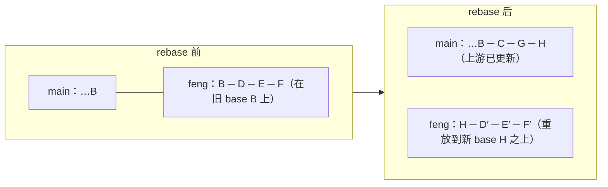
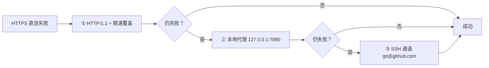

# OpenWorker Git 工作流

仓库拓扑与分支协作规则。本文档描述 fork 之后的三个 Git 仓库、两个分支各自的角色，以及同步上游 / 合并 main 到 feng 的完整流程。所有图形使用 Mermaid 绘制，需支持 Mermaid 的 Markdown 渲染器（GitHub、VS Code、Typora 等）查看。

## 0. 设计动机

这个工作流解决一个两难问题：**既要持续跟上游进展，又要保留自己的定制**。

- **跟上游**：OpenWorker 上游迭代很快（每周合并多个 PR）。fork 后如果埋头开发自己的定制，很快会与上游脱节，等想合并时已是天壤之别。
- **做定制**：直接在上游仓库上改会污染主线，也无法把定制推送回去。

所以设计了「**main 镜像 + feng 开发**」：

- `main` 是**同步通道**：只跟随上游，保证「上游最新进展」始终有一个干净的落点；
- `feng` 是**定制层**：所有 i18n 本地化、e2e 修复等私有改动都在这层；
- **rebase**（而非 merge）让 `feng` 永远像「贴着上游最新点重新长出来的定制层」——提交线一条直线，冲突只发生在我们真正改过的区域，方便逐处手工合并（保留上游新功能 + 我们的本地化）。

一句话：**main 负责「跟上」，feng 负责「个性化」，rebase 负责「保持两者的贴合力」。**

## 1. 仓库拓扑

本项目有三个 Git 仓库参与协作：

| 角色 | 地址 | remote 名 | 分支 | 能否推送 |
|---|---|---|---|---|
| 上游原始仓库 | `https://github.com/andrewyng/openworker` | `upstream` | `main` | 否（无权限，只读） |
| 我们的 fork | `https://github.com/chanf/openworker` | `github` | `main` + `feng` | 是（main 仅镜像、feng 可开发） |
| 本地仓库 | 本机 | — | `main` + `feng` | — |



## 2. 分支角色（铁律）

| 分支 | 用途 | 规则 |
|---|---|---|
| `main` | **只做同步通道** | 保持与 `andrewyng/openworker` 的 `main` 完全一致（仅 fast-forward），禁止本地提交，禁止直接开发。同时镜像到 `chanf/openworker` 的 `main`。 |
| `feng` | **唯一开发分支** | 所有开发工作都在此进行；可 push 到 `chanf/openworker` 的 `feng`。 |
| main → feng 合并 | 同步上游更新到开发分支 | **必须用 rebase，绝不 merge**，保持提交线为一条直线。 |

> ## ⛔ 最高级铁律
> **永远不要把 `feng` 分支的内容提交到 `main` 分支。**
> `feng` 的任何提交、merge、cherry-pick 都绝不允许出现在 `main` 上——`main` 只允许从 `upstream` fast-forward。如果你发现自己正站在 `main` 上准备 commit，立刻停下来，先 `git checkout feng` 再继续。误操作后果：本地 `main` 与上游分叉，修复成本高且违反整个同步模型。

## 3. 完整同步流程

```
① fetch 上游          git fetch upstream
② 更新本地 main       git checkout main && git merge --ff-only upstream/main
③ 镜像 main 到 fork   git push github main
④ rebase 到 feng      git checkout feng && git rebase main
   （或等效：          git pull --rebase upstream main）
⑤ 推送开发分支        git push github feng
```



冲突解决原则：**保留上游的新功能 + 我们 fork 的 i18n/本地化改动**，逐文件手工合并，而不是整体丢弃一方。

## 3.1 提交线时间线视图

rebase 之后的理想形态——`feng` 上是一条直线，无 merge 节点，本地开发提交被重放到上游最新点之上（新哈希、内容不变）：





- `main` 永远停留在上游最新点（如 `H`），与上游一致；
- `feng` 永远 = `main` 之上重放的开发提交（`D′──E′──F′`），一条直线。

## 4. 常用命令

```bash
# 查看 remote 配置
git remote -v

# 拉取上游最新，同步到 feng（最常用，一条命令）
git fetch upstream && git checkout feng && git pull --rebase upstream main

# 完整五步（第 3 节）
git fetch upstream
git checkout main && git merge --ff-only upstream/main && git push github main
git checkout feng && git rebase main
git push github feng

# 查看两端差异
git rev-list --left-right --count main...feng   # 左=main 独有，右=feng 独有
git log --oneline main..feng                    # feng 独有提交
git log --oneline upstream/main..main           # 本地 main 落后的提交

# 冲突解决后继续 rebase
git add <文件> && git rebase --continue

# 中止 rebase（想重来）
git rebase --abort
```

## 5. 网络故障排查

GitHub 直连经常不稳（HTTP2 framing / `Empty reply` / `Failed to connect ... port 443`），按序尝试：



1. **HTTP/1.1 + 限速绕过**（TCP 443 通但传输中断时）：
   ```bash
   GIT_HTTP_LOW_SPEED_LIMIT=1 GIT_HTTP_LOW_SPEED_TIME=999 \
     git -c http.version=HTTP/1.1 fetch <remote> <branch>
   ```

2. **本地代理**（直连 443 超时时，代理端口 7890）：
   ```bash
   git -c http.proxy=http://127.0.0.1:7890 fetch <remote> <branch>
   HTTPS_PROXY=http://127.0.0.1:7890 gh api ...   # 其它工具同理
   ```

3. **SSH 通道**（推送时最稳，SSH 认证已配置）：
   ```bash
   git push ssh://git@github.com/chanf/openworker.git feng:feng
   ```

> 排查小工具：`gh api repos/chanf/openworker/commits/<分支> --jq '.sha'` 即使 HTTPS 直连挂了也能拿到远端真实状态（gh 走独立网络路径）。
